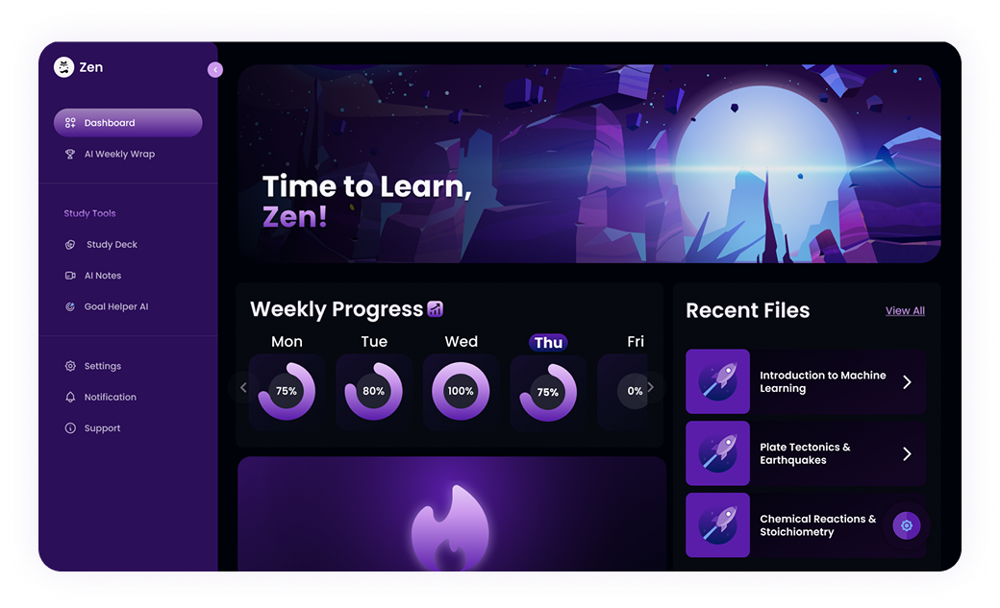

# 🐈‍⬛ Zen - AI-Powered Study Companion

> **Smarter Studying, Effortless Focus**  
> Boost your learning with AI-powered notes, insights, and progress tracking—all in one place.



## 🌟 Overview

Zen is an intelligent study companion designed to revolutionize how students learn and track their academic progress. Built with modern web technologies, it combines AI-powered note generation, interactive flashcards, progress tracking, and personalized study insights to create a comprehensive learning platform.

## ✨ Key Features

### 📝 AI-Powered Note Generation
- **Smart Content Processing**: Generate summaries from pasted text, uploaded files, or Google Drive documents
- **Instant Insights**: AI analyzes content to create structured, digestible notes
- **Multi-Source Support**: Import from various sources including Google Drive integration

### 🧠 Interactive Flashcards
- **Auto-Generation**: Create flashcards automatically from your notes using AI
- **Flip Animation**: Smooth 3D card animations for engaging study sessions
- **Progress Tracking**: Monitor your flashcard performance and retention rates

### 📊 Comprehensive Progress Tracking
- **Study Analytics**: Detailed breakdowns of study habits and performance
- **Streak Tracking**: Monitor daily study streaks and consistency
- **Goal Setting**: Set and track study hour goals with visual progress indicators
- **Weekly Wrap**: Comprehensive weekly reports of your learning journey

### 🎯 Goal Helper AI
- **Personalized Study Plans**: AI-generated study schedules tailored to your learning goals
- **Smart Recommendations**: Intelligent suggestions to optimize your study approach
- **Adaptive Learning**: Plans that adjust based on your progress and performance

### 😸 Study Personality Analysis
- **Learning Style Assessment**: Discover your unique study personality with fun cat-themed personas
- **Behavioral Insights**: Understand your study patterns and preferences
- **Personalized Tips**: Get customized advice based on your learning style

### 📈 Visual Progress Dashboard
- **Real-time Analytics**: Live updates on study sessions, notes created, and goals achieved
- **Contribution Graph**: GitHub-style activity visualization for study consistency
- **Performance Metrics**: Track scores, completion rates, and improvement over time

## 🛠️ Tech Stack

### Frontend
- **Framework**: [Next.js 15](https://nextjs.org/) with App Router
- **Language**: TypeScript
- **Styling**: Tailwind CSS with custom animations
- **UI Components**: Radix UI primitives
- **Animation**: Framer Motion & GSAP
- **Icons**: Lucide React & React Icons

### Backend & Database
- **Database**: PostgreSQL with Prisma ORM
- **Authentication**: Supabase Auth with Google OAuth
- **AI Integration**: Google Generative AI (Gemini)
- **File Storage**: Google Drive API integration

### Development Tools
- **Code Quality**: ESLint, Prettier, Husky
- **Package Manager**: npm/yarn/pnpm/bun support
- **Build Tool**: Turbopack for fast development
- **PWA**: Next PWA for offline capabilities

## 🚀 Getting Started

### Prerequisites
- Node.js 18+ 
- PostgreSQL database
- Google Cloud Console project (for AI and Drive integration)
- Supabase project

### Installation

1. **Clone the repository**
   ```bash
   git clone <repository-url>
   cd iseac-hackathon
   ```

2. **Install dependencies**
   ```bash
   npm install
   # or
   yarn install
   # or
   pnpm install
   ```

3. **Environment Setup**
   Create a `.env.local` file in the root directory:
   ```env
   # Database
   DATABASE_URL="postgresql://..."
   DIRECT_URL="postgresql://..."
   
   # Supabase
   NEXT_PUBLIC_SUPABASE_URL="your-supabase-url"
   NEXT_PUBLIC_SUPABASE_ANON_KEY="your-supabase-anon-key"
   
   # Google AI
   GOOGLE_AI_API_KEY="your-google-ai-api-key"
   
   # Google OAuth
   GOOGLE_CLIENT_ID="your-google-client-id"
   GOOGLE_CLIENT_SECRET="your-google-client-secret"
   ```

4. **Database Setup**
   ```bash
   npx prisma migrate dev
   npx prisma generate
   ```

5. **Run the development server**
   ```bash
   npm run dev
   ```
   
   Open [http://localhost:3000](http://localhost:3000) to view the application.

## 📁 Project Structure

```
src/
├── app/                    # Next.js App Router
│   ├── (auth)/            # Authentication pages
│   ├── (routes)/          # Main application routes
│   │   ├── ai-notes/      # AI note generation
│   │   ├── dashboard/     # Main dashboard
│   │   ├── goal-helper/   # AI study planning
│   │   ├── progress-tracker/ # Progress analytics
│   │   ├── study-deck/    # Flashcard interface
│   │   └── weekly-wrap/   # Weekly reports
│   ├── api/              # API routes
│   └── globals.css       # Global styles
├── components/           # Reusable UI components
│   ├── ui/              # Base UI components
│   └── modals/          # Modal components
├── hooks/               # Custom React hooks
├── lib/                 # Utility libraries
├── providers/           # Context providers
└── utils/               # Helper utilities

prisma/
├── schema.prisma        # Database schema
└── migrations/          # Database migrations

public/
├── screenshots/         # App screenshots
├── icons/              # Application icons
└── fonts/              # Custom fonts
```

## 🗃️ Database Schema

The application uses PostgreSQL with Prisma ORM. Key models include:

- **Profile**: User information and study statistics
- **Note**: AI-generated and user notes
- **Flashcard**: Interactive study cards
- **Exam**: Quiz results and scores
- **Progress**: Daily study progress tracking
- **Activity**: User activity logging
- **Session**: Study session data

## 🎨 Design Features

- **Dark Theme**: Sleek dark interface with purple accent colors
- **Smooth Animations**: Framer Motion and GSAP for fluid interactions
- **Responsive Design**: Mobile-first approach with desktop optimization
- **Custom Gradients**: Beautiful gradient backgrounds and text effects
- **3D Elements**: Interactive 3D flashcard animations

## 📱 PWA Support

Zen is built as a Progressive Web App with:
- Offline functionality
- App-like experience on mobile devices
- Push notifications (future feature)
- Fast loading with service worker caching

## 🔐 Authentication & Security

- **Supabase Auth**: Secure authentication system
- **Google OAuth**: Easy sign-in with Google accounts
- **Row Level Security**: Database-level security policies
- **Session Management**: Secure session handling

## 🤖 AI Integration

- **Google Gemini**: Advanced AI for content analysis and generation
- **Smart Summarization**: Intelligent content extraction and structuring
- **Personalized Recommendations**: AI-driven study suggestions
- **Natural Language Processing**: Understanding and processing study materials

## 🚀 Deployment

### Vercel (Recommended)
1. Connect your repository to Vercel
2. Add environment variables in Vercel dashboard
3. Deploy automatically on git push

### Other Platforms
The app can be deployed on any platform supporting Next.js:
- Netlify
- Railway
- Digital Ocean
- AWS Amplify

## 🤝 Contributing

1. Fork the repository
2. Create a feature branch: `git checkout -b feature/amazing-feature`
3. Commit your changes: `git commit -m 'Add amazing feature'`
4. Push to the branch: `git push origin feature/amazing-feature`
5. Open a Pull Request

## 📄 License

This project is licensed under the MIT License - see the [LICENSE](LICENSE) file for details.

## 🙏 Acknowledgments

- Built for the ISEAC Hackathon
- Inspired by modern study methodologies and AI advancements
- Special thanks to the open-source community for the amazing tools and libraries

---

<div align="center">
  <p>Made with ❤️ by the Zen team</p>
  <p>🐈‍⬛ Happy studying! 🐈‍⬛</p>
</div>
